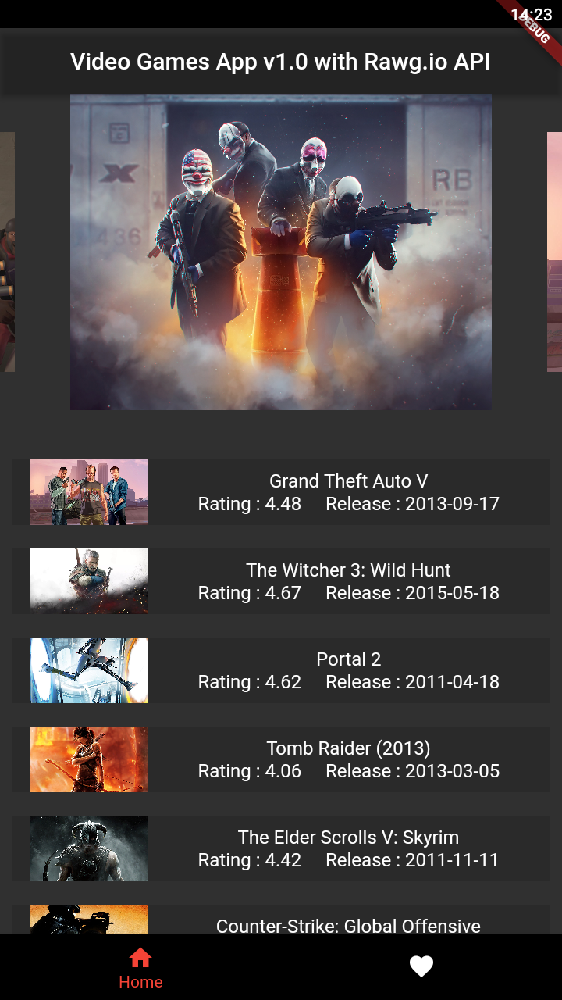
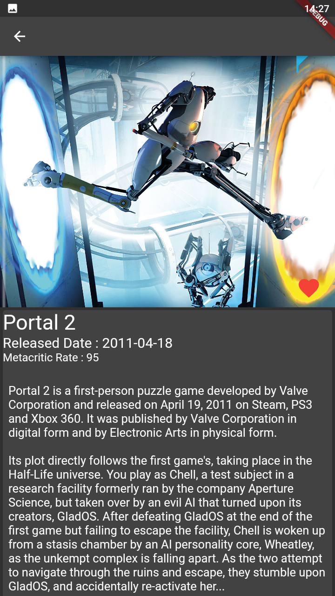
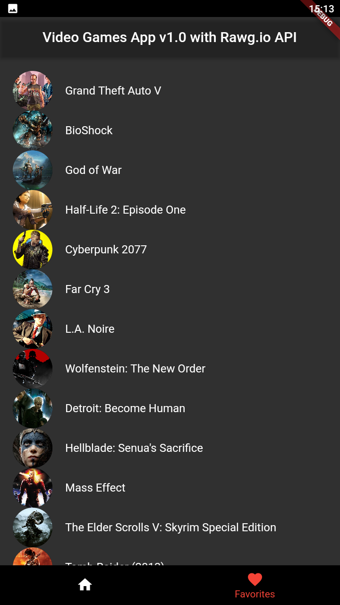

# video_games

This is a Flutter project works with firebase and api.
In this application users can list the games from api.
Users can see the details of the games. (released date, rating , description etc.)
Users can add/remove games to their favorites.

Screenshots of application

     
   
   

Packages that i use 

  <ul>
    <li>firebase_core: ^1.12.0</li>
  <li>cloud_firestore: ^3.1.8</li>
  <li>http: ^0.13.4</li>
  <li>carousel_slider: ^4.0.0</li>
  <li>cached_network_image: ^3.2.0</li>
  <li>get: ^4.6.1</li>
  <li>flutter_cache_manager: ^3.3.0</li>
  </ul>

